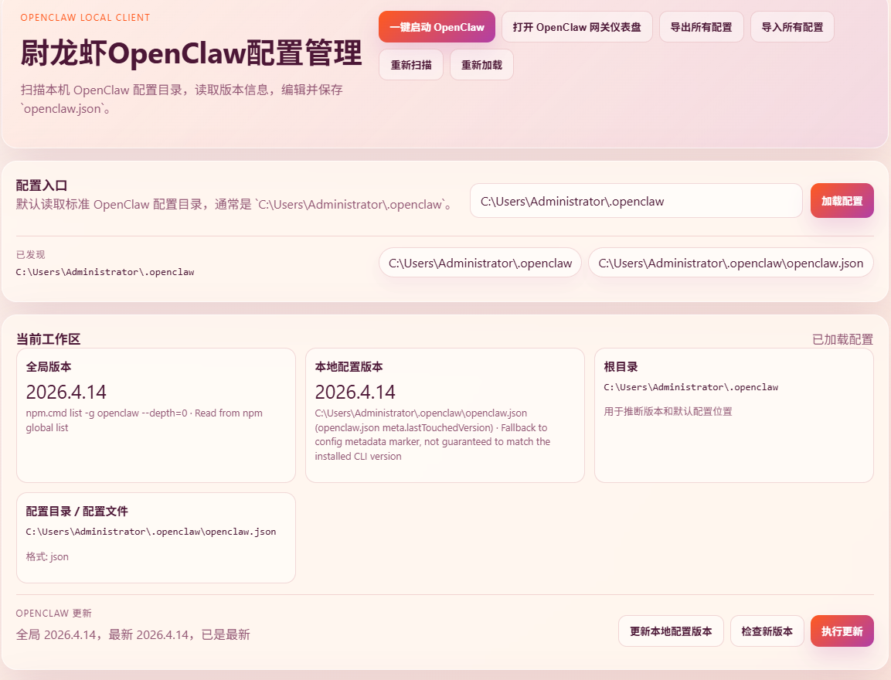

# 尉龙虾OpenClaw配置管理

这是一个采用“本地 HTTP 服务 + Electron 桌面壳”结构的本地客户端，用来查看和编辑 OpenClaw 配置目录、工作区信息，以及检查、更新并一键启动 OpenClaw。

## 界面


## 功能

- 读取标准 OpenClaw 配置目录，默认定位到 `C:\Users\Administrator\.openclaw`
- 加载并编辑 `openclaw.json`
- 展示当前本地 OpenClaw 版本信息
- 展示工作区关键文件
- 展示工作区已安装技能
- 支持点击工作区文件，弹窗查看并直接修改保存
- 支持点击工作区技能，弹窗查询详情并更新 `_meta.json` / `SKILL.md`
- 支持卸载工作区技能，删除 `workspace/skills` 下对应技能目录
- 支持卸载插件，从 `openclaw.json` 的 `plugins.installs` 和白名单中移除
- 提供结构化预览和中文说明
- 提供模型配置面板，支持新增/编辑模型并切换 `agents.defaults.model.primary`
- 支持通过 `openclaw onboard --non-interactive` 初始化新模型配置
- 提供渠道配置面板，支持新增/编辑 `channels.<provider>` 常用字段
- 检查 OpenClaw 最新版本
- 执行全局更新：`npm i -g openclaw@latest`
- 一键启动全局 `openclaw gateway`，启动前自动执行 `openclaw gateway stop`、结束已注册的 Windows Gateway 任务，并清理占用 18789 的 OpenClaw Gateway 进程
- 一键打开 ClawHub 官网：`https://clawhub.ai/`
- 支持输入 ClawHub 包名并执行：`clawhub install <包名>`
- 通过弹窗实时查看 ClawHub 安装输出和进度
- 一键将本地配置版本刷新为最新 OpenClaw 版本

## 启动

1. 安装 Node.js 22+
2. 在项目目录执行：

```bash
npm install
```

3. 启动桌面程序：

```bash
npm start
```

4. 如需仅启动本地 HTTP 服务：

```bash
npm run start:web
```

## 页面内容

- 配置入口：快速加载 OpenClaw 配置目录或 `openclaw.json`
- 当前工作区：查看版本、根目录、配置文件位置
- 工作区文件：显示常用关键文件，支持点击弹窗查看和修改
- 工作区技能：显示 `workspace/skills` 下的技能目录，支持查询详情、更新和卸载
- 插件卸载：显示 `plugins.installs` 与 `plugins.allow` 中的插件，支持从配置中移除
- 模型配置：读取 `agents.defaults.models`，支持编辑模型 Provider、Model ID、Base URL、API Key 和其他 JSON 配置，并切换主模型
- onboard 初始化：使用模型表单中的 Provider、Model ID、Base URL、API Key 调用 `openclaw onboard --non-interactive`
- 渠道配置：读取 `channels`，支持编辑 enabled、dmPolicy、allowFrom、groupPolicy、groupAllowFrom、defaultAccount 和其他 JSON 配置
- 结构化预览：按 JSON 顶层字段查看配置
- 中文解析说明：按模型、网关、插件、渠道、工作区等维度输出摘要
- 原始配置内容：直接编辑并保存 `openclaw.json`
- OpenClaw 更新：检查新版本并执行更新
- ClawHub 安装：输入包名后执行 `clawhub install`，并在弹窗查看实时日志
- 一键启动：先自动停止已运行的 Gateway，再拉起本机全局 `openclaw gateway`
- 本地配置版本：一键将 `meta.lastTouchedVersion` 与 `wizard.lastRunVersion` 刷新到最新

## 架构

- Electron 主进程负责桌面窗口生命周期
- 本地原生 Node.js `http` 服务负责页面和 API
- Electron 窗口通过 `http://127.0.0.1:4173` 加载本地界面
- 前端仍然通过 HTTP 调用本地 `/api/*` 接口

## 后端实现

- 本地配置优先从 `openclaw.json` 读取
- 本地版本优先从配置目录中的版本文件推断
- 工作区路径优先从 `agents.defaults.workspace` 推断
- 更新接口执行：

```bash
npm i -g openclaw@latest
```

## API

- `GET /api/health`：健康检查
- `GET /api/discovery`：读取标准 OpenClaw 配置目录候选
- `POST /api/openclaw/load`：加载配置目录和工作区信息
- `POST /api/openclaw/save`：保存 `openclaw.json`
- `POST /api/openclaw/model-config`：新增/更新模型配置，并可切换主模型
- `POST /api/openclaw/onboard-model`：通过 `openclaw onboard --non-interactive` 初始化模型配置，以流式日志返回执行进度
- `POST /api/openclaw/channel-config`：新增/更新渠道配置
- `GET /api/openclaw/update-status`：检查当前版本与最新版本
- `POST /api/openclaw/update`：执行全局更新
- `POST /api/openclaw/launch`：自动修复已有 Gateway 进程占用后，一键启动 `openclaw gateway`
- `POST /api/clawhub/install`：执行 `clawhub install <包名>`，以流式日志返回安装进度
- `POST /api/openclaw/update-local-version`：一键更新本地配置版本到最新 OpenClaw 版本
- `POST /api/workspace/file-detail`：读取工作区文件详情
- `POST /api/workspace/file-save`：保存工作区文件修改
- `POST /api/workspace/skill-detail`：查询工作区技能详情
- `POST /api/workspace/skill-update`：更新工作区技能元数据和文档
- `POST /api/workspace/skill-uninstall`：卸载工作区技能目录
- `POST /api/openclaw/plugin-uninstall`：从配置中卸载插件

## 桌面壳说明

- `npm start` 会先启动本地 HTTP 服务，再由 Electron 打开桌面窗口
- 不再依赖系统默认浏览器承载界面
- 如需调试纯 Web 模式，可使用 `npm run start:web`

## 打包 Windows EXE

1. 安装依赖：

```bash
npm install
```

2. 执行打包：

```bash
npm run build:win
```

3. 产物位置：

```text
dist/electron/WeiOpenClawManager-Setup-1.7.0.exe
```

## 打包方式

- 当前使用 `electron-builder` 进行 Windows 打包
- 打包目标为 `NSIS` 标准安装程序，不再使用旧的 Node SEA / IExpress 方案
- 打包命令为 `npm run build:win`
- 安装包命名格式为 `WeiOpenClawManager-Setup-${version}.exe`
- 当前版本号为 `1.7.0`
- 默认输出目录为 `dist/electron`
- 安装模式为“所有用户安装”
- 默认安装目录为 `D:\Program Files\OpenClawManager`
- 打包时优先复用本地 `node_modules/electron/dist`，避免重复下载 Electron 运行时
- 安装器、卸载器、应用图标资源均来自项目的 [build](d:\home\Manage-for-openclaw\build) 目录

## EXE 说明

- `build:win` 现在直接使用 `electron-builder` 生成标准 Windows 安装程序
- 安装器、卸载器、应用窗口图标都使用 [build](d:\home\Manage-for-openclaw\build) 目录内资源
- 目标为 NSIS 安装包，仅支持所有用户安装，默认安装到 `D:\Program Files\OpenClawManager`
- 桌面和开始菜单快捷方式名称为 `尉龙虾OpenClaw配置管理`
- 默认输出目录为 `dist/electron`

## 注意事项

- 这是本地工具，不包含鉴权
- 更新 OpenClaw 依赖本机 `npm` 全局安装权限
- 安装 ClawHub 包依赖本机可执行 `clawhub` 命令
- 最新版本检查依赖访问 npm registry
- 如果修改后页面没有反映新接口，请先重启 `npm start`
